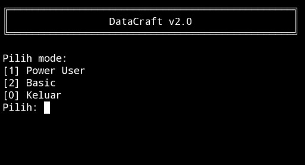
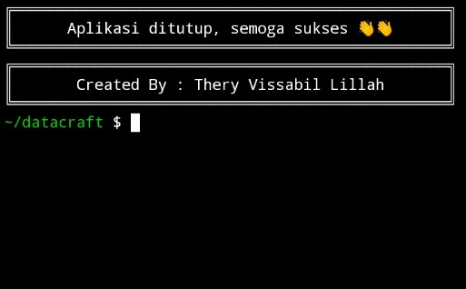

# DataCraft

# DataCraft adalah CLI tool berbasis Python untuk EDA (Exploratory Data Analysis) — fokus pada data cleaning, normalisasi, dan merge multi-file secara interaktif.

---

## Instalasi

Pastikan Python 3.10+ sudah terinstall, lalu install dependencies:

pip install pandas openpyxl pyarrow

«"pyarrow" hanya diperlukan jika ingin menggunakan format output Parquet (Power Mode).»

---

## Fitur

- Load multi-format: CSV, JSON, GeoJSON, Excel (XLSX, XLS), TSV, JSONL, Parquet
- 2 mode:
  - Power Mode → fleksibel, kontrol penuh
  - Basic Mode → guided, cepat, minim input
- Auto detect pattern: deteksi inkonsistensi format otomatis
- Data cleaning:
  - Transformasi berbasis pattern
  - Preview sebelum & sesudah perubahan
- Rename kolom:
  - Referensi antar file
  - Bulk rename manual
- Resolusi inkonsistensi:
  - Deteksi nilai tidak cocok antar file
  - Kandidat otomatis
  - Manual / pilih kandidat / skip
- Merge multi-file:
  - Sequential merge "(1 + 2) + 3"
  - Outer join
- Tab autocomplete path (Linux/Termux)
- Output format:
  - Basic Mode → CSV, TSV, JSON, JSONL, XLSX, GeoJSON
  - Power Mode → + Parquet

---

## Cara Pakai

python dc_v2.5.py

Flow umum:

1. Pilih mode (Power / Basic)
2. Masukkan file (1 atau lebih)
3. Rename kolom (opsional)
4. Auto detect & cleaning
5. Resolve inkonsistensi
6. Merge
7. Simpan hasil

---

## Struktur Project
```
datacraft/
├── dc_v2.5.py
└── core/
    ├── __init__.py
    ├── io.py
    ├── cleaning.py
    ├── merge.py
    ├── profiling.py
    ├── utils.py
    ├── ui.py
    └── modes/
        ├── power.py
        └── basic.py
```
---

## Use Case

- Menggabungkan data dari berbagai sumber
- Membersihkan data sebelum analisis
- Normalisasi format kolom (kode wilayah, nama, dll)
- Alternatif CLI untuk cleaning data tanpa Excel

---

## Batasan

- Optimal untuk dataset kecil–menengah
- Merge masih berbasis single key per proses
- Tidak semua relasi multi-level otomatis optimal (akan ditingkatkan di v3)

---

## Status

«⚠️ v2.5 — Refactor & Stability Update
Struktur sudah modular, fitur utama stabil, masih ada ruang pengembangan.»

---

## Roadmap

- [ ] Multi-key merge (chained / graph-based)
- [ ] Smart key suggestion
- [ ] Improve inconsistency resolution
- [ ] Feature engineering (transform kolom)
- [ ] Statistik dasar & missing value detection
- [ ] Visualisasi CLI
- [ ] v3: arsitektur merge lebih cerdas

---

## Tujuan

DataCraft dibuat sebagai:

- Tool praktis untuk workflow EDA pribadi
- Alternatif ringan dari cleaning manual di Excel
- Fondasi menuju sistem data processing yang lebih besar

---

**Main menu:**





**Exit:**




## Lisensi

MIT License — bebas dipakai dan dimodifikasi.
=======
